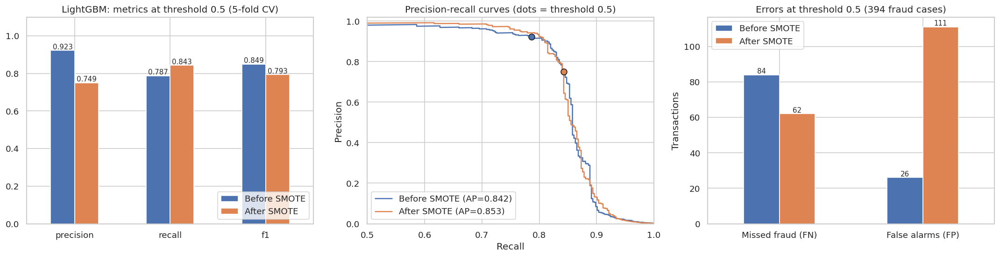
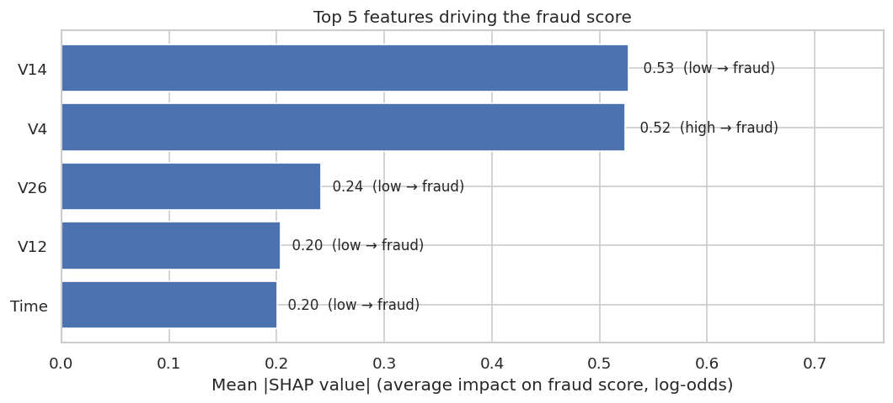
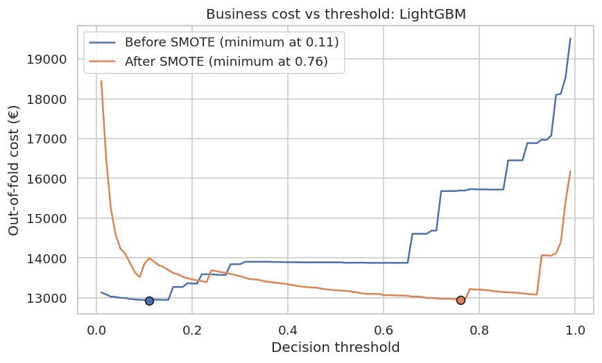
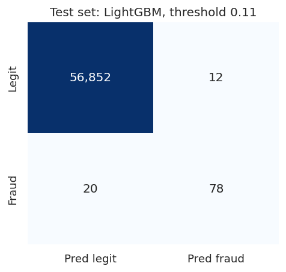

# Credit Card Fraud Detection

End-to-end fraud detection on a highly imbalanced dataset (0.17% fraud): model comparison and stress-testing, class-imbalance handling, cost-based threshold selection, SHAP explainability, drift monitoring with Evidently AI, and experiment tracking with MLflow.

**Final model:** LightGBM at a cost-optimised threshold of 0.11. On a held-out test set used once, it **catches 80% of frauds with 87% of alerts being real fraud** (12 false alarms in 56,864 legitimate transactions).

| Test set (56,962 transactions, 98 fraud) | Result |
|---|---|
| Recall | **0.796** (78 of 98 frauds caught) |
| Precision | **0.867** |
| F1 | 0.830 |
| AUC-ROC | 0.974 |
| Average precision (PR-AUC) | 0.860 |
| Fraud value caught | 57% (€6,057 of €10,645) |

→ Full write-up: [`Credit_Card_Fraud_Detection.ipynb`](Credit_Card_Fraud_Detection.ipynb) · Model documentation: [`MODEL_CARD.md`](MODEL_CARD.md)

---

## Approach

1. **EDA.** 284,807 transactions, 492 frauds. A model that never predicts fraud is 99.83% accurate, so evaluation uses recall, precision, F1, AUC-ROC, average precision and a **business-cost** metric (missed fraud value + €5 per false alarm).
2. **Preprocessing.** `Time` and `Amount` standardised inside a pipeline (no leakage); stratified 80/20 train/test split; the test set is locked away until the end.
3. **Four baseline models** on the raw imbalanced data (Logistic Regression, Random Forest, XGBoost, LightGBM), each logged to MLflow.
4. **Stress-testing the model choice.** Paired bootstrap on the validation set, 5-fold stratified cross-validation (394 frauds rather than 79), cost curves across thresholds, and a sensitivity analysis over false-alarm costs from €1 to €50.
5. **Class imbalance.** SMOTE applied inside the cross-validation pipeline (training folds only), compared side by side with the unresampled model; both runs logged to MLflow as child runs.
6. **Threshold selection** by minimising out-of-fold business cost, then **one final test-set evaluation**.
7. **Explainability.** SHAP TreeExplainer: top-5 features, beeswarm, and a single-case waterfall, translated into a plain-language summary.
8. **Drift and monitoring.** Evidently AI data-drift reports for (A) day 1 vs day 2 and (B) a simulated production shift, plus a monitoring and retraining plan.

## Model comparison (5-fold CV on the training set, threshold 0.5)

| Model | Recall | Precision | F1 | AUC-ROC | Avg. precision | Missed fraud | False alarms |
|---|---|---|---|---|---|---|---|
| **LightGBM** | **0.787** | 0.923 | 0.849 | **0.984** | 0.842 | **84** | 26 |
| Random Forest | 0.777 | 0.939 | 0.850 | 0.942 | 0.839 | 88 | 20 |
| XGBoost | 0.774 | **0.950** | **0.853** | 0.978 | **0.844** | 89 | **16** |
| Logistic Regression | 0.642 | 0.872 | 0.740 | 0.978 | 0.760 | 141 | 37 |

## Key findings

- **Default gradient boosting can fail silently on extreme imbalance.** Out-of-the-box LightGBM scored AUC 0.51 (chance level). Adding the standard L2 leaf penalty (`reg_lambda=1.0`) fixed it and made it the best model. XGBoost needed `max_delta_step=1` to avoid collapsing on one CV fold.
- **The top three models are statistically tied on recall.** LightGBM leads by 4–5 frauds out of 394. Once each model gets its own cost-optimal threshold, Random Forest (cheap false alarms) or XGBoost (expensive false alarms) edges ahead by up to 8%. The choice therefore depends on a business assumption, and the notebook documents it.
- **SMOTE moved the operating point rather than improving the model.** Recall at 0.5 rose from 0.787 to 0.843, but false alarms quadrupled (26 → 111) and PR-AUC barely changed. After threshold tuning the two variants cost the same, so the simpler model was kept.
- **Counts hide value.** The model catches 80% of fraud cases but only 57% of fraud value: five missed transactions (€520–€1,810) account for 94% of the missed amount.
- **SHAP exposed a production risk.** The top drivers are V14, V4, V26, V12 and `Time`. `Time` counts seconds from the start of a two-day recording, so the model learned an artefact that will not generalise.
- **Drift alarms need interpretation.** From day 1 to day 2, Evidently flagged 73% of columns with no loss of recall (a false alarm). A small targeted shift doubled false alarms, yet Evidently's whole-distribution distance on the fraud score missed it. Monitoring should focus on alert rate, the tail of the score distribution, and drift in the top SHAP features.

| | |
|---|---|
|  |  |
|  |  |

## Repository structure

```
├── Credit_Card_Fraud_Detection.ipynb   # Full analysis, executed with outputs
├── MODEL_CARD.md                       # Intended use, data limits, results, failure modes, ethics, EU AI Act
├── README.md
├── requirements.txt
├── figures/                            # All charts used in the notebook and README
├── reports/
│   ├── baseline_model_comparison.csv   # Validation-set comparison
│   ├── cv_model_comparison.csv         # 5-fold CV comparison
│   ├── shap_top5_features.csv
│   ├── drift_report_A_day1_vs_day2.html        # Evidently report (open in a browser)
│   ├── drift_report_B_simulated_shift.html     # Evidently report
│   ├── drift_slice_performance.csv
│   └── mlflow_runs_summary.csv         # All MLflow runs, params and metrics in one table
├── mlflow.db                           # MLflow tracking store (SQLite)
└── mlartifacts/                        # MLflow artifacts: logged models, figures, drift reports
```

## Reproduce

```bash
pip install -r requirements.txt
# Download creditcard.csv from https://www.kaggle.com/datasets/mlg-ulb/creditcardfraud
# and place it in the repository root (it is not committed: at over 100 MB it exceeds GitHub's file-size limit).
jupyter notebook Credit_Card_Fraud_Detection.ipynb     # run all cells, about 10 minutes on a laptop

# Browse the logged experiments
mlflow ui --backend-store-uri sqlite:///mlflow.db
```

The MLflow artifact location is stored as an absolute path from the machine that created the runs. Metrics, parameters and tags are fully browsable from `mlflow.db`. To open the logged model files, re-run the notebook locally, which recreates the store with local paths.

## Limitations

Two days of anonymised 2013 data with 492 frauds, randomly split: results are an optimistic, small-sample estimate and the model is **not production-ready**. See [`MODEL_CARD.md`](MODEL_CARD.md) for failure modes, ethical considerations and a note on the model's status under the EU AI Act (fraud detection is explicitly *excluded* from the Annex III high-risk list, but reusing its scores for credit decisions would be high-risk).

## Tech stack

Python · pandas · scikit-learn · imbalanced-learn · XGBoost · LightGBM · SHAP · MLflow · Evidently AI · matplotlib / seaborn

*Dataset: Worldline and the Machine Learning Group of ULB, via [Kaggle](https://www.kaggle.com/datasets/mlg-ulb/creditcardfraud) (Open Database License).*
